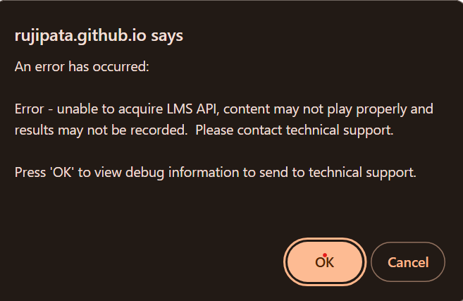

Showcase for Captivate Project for Trigonometry (MATH 1060-SPRING 2021-synchronous online) -- module 2 lesson 3 (2). If an error message (see below) occurs when first openning in a web browser, ignore the message by clicking the 'ok' button on the message window. 

<!--captivate.png){width="150" height="75"}-->

